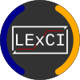

# LExCI 2

The **L**earning and **Ex**periencing **C**ycle **I**nterface (LExCI) is a
framework for reinforcement learning (RL) with embedded systems. It bridges the
gap between established, traditional RL-libraries and embedded devices with
their inherent limitations and unique requirements. In particular, it utilises
[Ray/RLlib](https://github.com/ray-project/ray) for training agents and
[TensorFlow](https://github.com/tensorflow/tensorflow)/[TensorFlow Lite Micro](https://github.com/tensorflow/tflite-micro)
to model their neural networks.

    

## Installation

This section summarises LExCI's installation process. For a detailed guide,
consult the
[documentation](https://github.com/mechatronics-RWTH/lexci-2/blob/main/documentation/02_installation.md).

### Virtual Environment

It is *highly* recommended to install LExCI in a virtual environment using
[venv](https://docs.python.org/3/library/venv.html) or
[Anaconda](https://docs.anaconda.com/free/anaconda/)/[Miniconda](https://docs.anaconda.com/free/miniconda/).
That's because i) the setup script demands fixed versions of third-party
packages and ii) because `ray` (one of LExCI's dependencies) is patched during
installation.

#### venv

1. Install Python 3.9.15 on your system.
2. Create a folder for your virtual environment(s) in your home directory by
   typing `mkdir ~/.venv` into a terminal or PowerShell. You can choose a
   different location if you so prefer.
3. Create the environment proper with `python3 -m venv ~/.venv/lexci2`. On
   Windows, you need to expand `~`, i.e. replace it with
   `C:\Users\YOUR_USER_NAME`.
4. Activate the virtual environment with `source ~/.venv/lexci2/bin/activate`
   on Linux or `~/.venv/lexci2/Scripts/Activate.ps1` on Windows. For the latter,
   you may have to
   [change the execution policy of the PowerShell](https://learn.microsoft.com/en-us/powershell/module/microsoft.powershell.security/set-executionpolicy?view=powershell-7.4)
   (e.g. by typing
   `Set-ExecutionPolicy -ExecutionPolicy RemoteSigned -Scope CurrentUser` into
   the PowerShell).

Should you want to remove the virtual environment, simply delete
`~/.venv/lexci2`.

#### Anaconda

* Open a terminal (on Linux) or Anaconda prompt (on Windows) and type
  `conda create --name lexci2 python=3.9.15` in order to create the environment.
  Run `conda activate lexci2` to activate it.
* Type `conda deactivate` to deactivate the environment and
  `conda env remove --name lexci2` if you wish to delete it.

### Linux

1. Install required software packages by typing
   `apt install gcc gpp g++ gdb git` into a terminal.
2. Activate the virtual environment.
3. Run `python3 -m pip install pip==22.0.4` and then
   `python3.9 -m pip install setuptools==58.1.0 wheel==0.38.4` as newer versions
   of these packages may not be able to install LExCI's dependencies.
4. Download or clone this repository and `cd` to its location. Check out a
   version tag and do not use the `main` branch!
5. Run `python3.9 -m pip install .`.
6. Type `python3.9 -m pip install matlabengine==VERSION` where `VERSION` is the
   latest package version for your MATLAB installation. All available versions
   are listed [here](https://pypi.org/project/matlabengine/#history). This step
   can be skipped if you don't plan to automate MATLAB/Simulink.

To uninstall LExCI, open a terminal, activate its virtual environment, and type
`python3.9 -m pip uninstall lexci-2`.

### Windows

LExCI cannot be fully installed on Windows as its `Master` needs
[Ray/RLlib](https://github.com/ray-project/ray) which offers limited support for
the operating system. Nevertheless, a partial setup can be done in order to
facilitate writing Minions.

1. Download [Cygwin](https://www.cygwin.com/).
2. Open a PowerShell or Anaconda Powershell Prompt and `cd` to Cygwin's download
   folder.
3. Type `setup-x86_64.exe --no-admin` in order to run the installer without
   administrator rights. Perform a standard installation and select the
   following additional packages from **Devel** (you may have to change **View**
   to **Category**):
   - `make` (`>= 4.4.1-2`)
   - `mingw64-x86_64-binutils` (`>= 2.43.1-1`)
   - `mingw64-x86_64-gcc-core` (`>= 12.4.0-1`)
   - `mingw64-x86_64-gcc-g++` (`>= 12.4.0-1`)
4. Activate the virtual environment.
5. Type `$Env:CYGWIN_PATH = "C:\path\to\cygwin64"` to store the path to Cygwin's
   installation directory in an environment variable.
6. Run `python -m pip install pip==22.0.4` and then
   `python -m pip install setuptools==58.1.0 wheel==0.38.4` since newer
   versions of these packages may not be able to install LExCI's dependencies.
7. Download or clone this repository and `cd` to its location. Check out a
   version tag and do not use the `main` branch!
8. Run `python -m pip install .`.
9. Type `python -m pip install matlabengine==VERSION` where `VERSION` is the
   latest package version for your MATLAB installation. All available versions
   are listed [here](https://pypi.org/project/matlabengine/#history). This step
   can be skipped if you don't plan to automate MATLAB/Simulink.

To uninstall LExCI, open a PowerShell or an Anaconda Powershell Prompt, activate
its virtual environment, and type `python -m pip uninstall lexci-2`.

## Support

If you have any questions, feel free to ask them on the repository's
[Discussions page](https://github.com/mechatronics-RWTH/lexci-2/discussions).
Bugs, feature requests, and the like should be reported/posted as
[Issues](https://github.com/mechatronics-RWTH/lexci-2/issues).

Inquiries concerning (research) projects involving LExCI can be sent via e-mail
to: [lexci@mmp.rwth-aachen.de](mailto:lexci@mmp.rwth-aachen.de)

## Publications

- [Badalian, K., Koch, L., Brinkmann, T., Picerno, M., Wegener, M., Lee, S.-Y., Andert, J.: LExCI: A framework for reinforcement learning with embedded systems. Applied Intelligence (2024) https://doi.org/10.1007/s10489-024-05573-0](https://link.springer.com/article/10.1007/s10489-024-05573-0)

If you use LExCI for your research, please cite our paper:

    @article{Badalian2024,
        author={Badalian, Kevin and Koch, Lucas and Brinkmann, Tobias and Picerno, Mario and Wegener, Marius and Lee, Sung-Yong and Andert, Jakob},
        year={2024},
        month={06},
        day={26},
        title={{LE}x{CI}: {A} framework for reinforcement learning with embedded systems},
        journal={Applied Intelligence},
        issn={1573-7497},
        url={https://doi.org/10.1007/s10489-024-05573-0},
        doi={10.1007/s10489-024-05573-0}
    }

## Licence

LExCI 2 is licenced under the
[Apache License 2.0](https://www.apache.org/licenses/LICENSE-2.0.txt).
