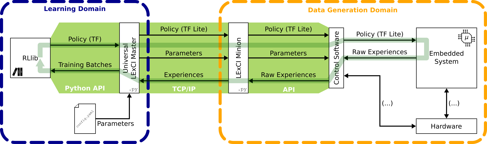

# Introduction

In this part of the documentation, you'll get a brief summary of the motivation
behind developing LExCI, what the framework does, and how it operates.

## Motivation

Embedded systems/devices are specialised computers which are integrated into
larger systems where they act as control units. They are typically characterised
by being physically small, offering adequate performance for their task, a
rugged design, and a real-time operating system. Despite their size, embedded
devices play a major role in keeping our modern world moving: they are the
electronic control units (ECUs) in our vehicles, the chips that regulate traffic
signals, or the computers inside aircraft.

With the emergence of artificial intelligence (AI) and its ever-increasing
prevalence in so many areas of life, the question naturally arose whether AI
methods could be utilised to learn control functions, i.e. the software that
runs on embedded systems. Reinforcement learning (RL) is particularly
interesting in that regard as it generates its own training data. More
precisely, a RL agent freely interacts with its environment to collect
experiences which are then used to optimise its policy (that is, the control
function). As a result, little human input is needed to obtain the finished
software compared with traditional development approaches.

Considering all this, the combination of embedded devices and RL might sound
like a match made in Heaven, but there's a catch: established machine learning
(ML) and RL libraries are often incompatible with the inherent limitations of
embedded systems (e.g. the lack of disk space, memory, and computing power).
Consequently, scientists and engineers have been compelled to implement
algorithms and data structures (for example, neural networks (NNs)) themselves
in the past to ensure that they work on the targetted device. In a sense, people
had to reinvent the wheel and they've done so successfully as research papers
prove. It would be unfair to expect a handful of engineers to write full-fledged
ML/RL libraries *on top* of their actual jobs; one has to acknowledge, though,
that these isolated solutions generally fall short of what professional software
is capable of.

## The LExCI Framework

Given that RL software cannot run *on* (most) embedded systems, we thought to
ourselves: What if one took the RL agent out of its library, somehow deployed it
on the target system, and fed the so generated data back to the library? The
answer to that question is LExCI, the *Learning and Experiencing Cycle
Interface*, which acts as a mediator between the worlds of embedded computing
and RL. The framework utilises
[Ray/RLlib](https://github.com/ray-project/ray) to train agents and
[TensorFlow](https://github.com/tensorflow/tensorflow)/[TensorFlow Lite Micro](https://github.com/tensorflow/tflite-micro)
to model their NNs.

### Modus Operandi

LExCI is made up of two main Python scripts: the Universal LExCI Master as the
coordinator and an interface to RLlib on one side and the LExCI Minion for
interacting with the embedded system on the other (see Figure 1 below).

|  |
| :--: |
| Figure 1: Architecture of the LExCI framework |
| (C) K. Badalian et al. \| Source: https://link.springer.com/article/10.1007/s10489-024-05573-0 \| [Creative Commons Attribution 4.0 International License](https://creativecommons.org/licenses/by/4.0/) \| This figure has been modified. |

The framework continuously completes so called *cycles*. At the beginning of
one, the LExCI Master fetches the current version of the agent's policy (i.e.
the control strategy of the agent) and converts it into the TensorFlow Lite
Micro format. This data is bundled up with other training-related parameters and
sent to the LExCI Minion which, in turn, overwrites the policy on the embedded
system via some control sofware and starts running episodes until the required
number of experiences has been generated. Those raw experiences are then
post-processed and sent back to the Master which arranges them into training
batches and passes them to RLlib. The library updates the agent based on the new
data and the cycle starts anew. When using an off-policy RL algorithm, the
Master continues training with experiences drawn from its replay buffer while
the Minion is busy.

Every couple of cycles, a validation is performed. During such a cycle, actions
aren't sampled stochastically according to the action distributions that the
agent returns for the observations; instead, the mean of the distribution is
chosen in every step. Hence, the behaviour becomes deterministic and lends
itself better to evaluating the performance of the agent.

LExCI's architecture is suited for parallelisation and, as a matter of fact, the
framework supports spawning multiple Minion instances. When more than one is
available, the workload is split between the Minions, i.e. each one only
generates a fraction of the experiences. This features comes in especially handy
in scenarios where data collection is the bottleneck of the process.
